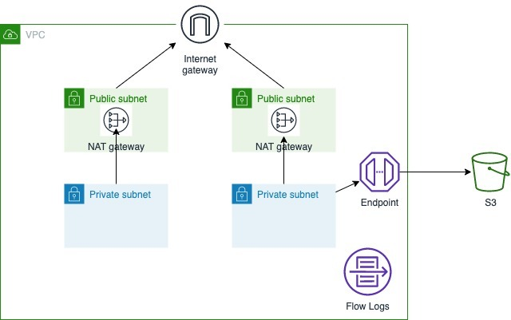

# CloudFormation Quiz

### 1. Create a VPC.

VPC Architecture:


**Input Requirements** (20'):
+ Create 1 VPC across 2 availibility zones. Each AZ has 1 public subnet and 1 private subnet
+ Create 1 EIP in each AZ
+ Create 1 NAT Gateway in each AZ
+ Create 1 Internet Gateway
+ Set IGW as public subnet default gateway, and NAT Gateway as private subnet default gateway

**Bonus 1** (10'):
+ Use parameter for VPC and Subnet CIDR input

**Bonus 2** (10'):
+ Enable VPC Flowlog, and send log to cloudwatch log group

**Bonus 3** (10'):
+ Enable S3 VPC endpoint

### 2. Create an empty ECS cluster.

Below is the resource defination for ECS cluster with container sights enabled:

```yaml
ECSCluster:
  Type: 'AWS::ECS::Cluster'
  Properties:
    ClusterName: MyCluster
    ClusterSettings:
      - Name: containerInsights
        Value: enabled
```

More info for the resource defination in CloudFormation, please check [here](https://docs.aws.amazon.com/AWSCloudFormation/latest/UserGuide/aws-resource-ecs-cluster.html)

**Input Requirements** (20'):
+ Allow to specify the cluster name
+ Allow to specify the status of Container Insights for the ECS cluster

**Output Requirements** (5'):
+ Output the ARN of the ECS cluster

**Bonus 1** (10'):
+ Create [stack policy](https://docs.aws.amazon.com/AWSCloudFormation/latest/UserGuide/protect-stack-resources.html) for the stack to prevent further updates to the ECS cluster

**Bonus 2** (10'):
+ Use [nested stack](https://docs.aws.amazon.com/AWSCloudFormation/latest/UserGuide/using-cfn-nested-stacks.html) to spin up the ECS cluster. (Create a root stack on top of the ECS cluster stack.)
+ Output the ARN of the ECS cluster

**Bonus 3** (10'):
+ Export the ARN of the ECS cluster, the name of the export variable is `myECSArn`
