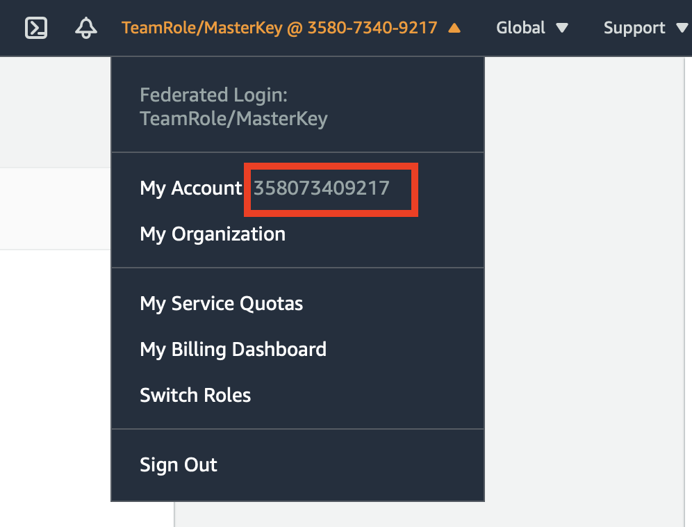

### Overview

If you created an AWS resource outside of AWS CloudFormation management, you can bring this existing resource into AWS CloudFormation management using resource import. You can manage your resources using AWS CloudFormation regardless of where they were created without having to delete and re-create them as part of a stack.

### Topics Covered

By the end of this lab, you will be able to:

+ Importing existing resources into a stack

### Start Lab

#### 1. Creating a new stack (dev)

1. Open the **[AWS CloudFormation](https://console.aws.amazon.com/cloudformation)** link in a new tab and log in to your AWS account.
1. Click on **Create stack** (_With new resources (Standard)_ if you have clicked in the top right corner).
1. In **Prepare template**, choose **Template is ready**.
1. In **Template source**, choose **Upload a template file**.
1. Click on **Choose file** button and navigate to your workshop directory.
1. Select the file `lab06-stack.yaml`.
1. Click **Next**.
1. Provide a **Stack name**: **cfn-workshop-006**.
    + The _Stack name_ identifies the stack. Use a name to help you distinguish the purpose of this stack.
    + Click **Next**.
1. Choose a **EnvironmentType**: **dev**.
1. You can leave other **Configure stack options** default, click **Next**.
1. On the **Review <stack_name>** page, scroll down to the bottom and click on **Create stack**.
1. You can click the **refresh** button a few times until you see in the status **CREATE_COMPLETE**.
1. You can navigate to **Outputs** tab, you can see the **BucketName** which contains **dev** string.

#### 2. Manually creating a s3 bucket resource


1. Sign in to the AWS Management Console and open the Amazon S3 console at [https://console\.aws\.amazon\.com/s3/](https://console.aws.amazon.com/s3/)\.

1. Choose **Create bucket**\.

   The **Create bucket** wizard opens\.

1. In **Bucket name**, enter the name for your bucket\: **test-resource-import-<ACCOUNT-ID>**

> You can get the account id by clicking the top-right in the AWS console
> 

   The bucket name must:
   + Be unique across all of Amazon S3\.
   + Be between 3 and 63 characters long\.
   + Not contain uppercase characters\.
   + Start with a lowercase letter or number\.

1. Leave other configurations as default, click **Create bucket** button.

#### 3. Add the import resource to the stack template.

1. Open and Edit the file **cfn-workshop-006**
1. Add the new resource in the file
```
  ImportBucket:
    Type: AWS::S3::Bucket
    DeletionPolicy: Retain
    Properties:
      BucketName: !Sub 'test-resource-import-${AWS::AccountId}'
      PublicAccessBlockConfiguration:
        BlockPublicAcls: true
        BlockPublicPolicy: true
        IgnorePublicAcls: true
        RestrictPublicBuckets: true
```
> The well-updated stack template is [here](./lab06-stack-import-resource.yaml) for your reference.

#### 3. Import the existing resource into the stack using the AWS Management Console

1. Sign in to the AWS Management Console and open the AWS CloudFormation console at [https://console\.aws\.amazon\.com/cloudformation](https://console.aws.amazon.com/cloudformation/)\.

1. On the **Stacks** page, choose the stack **cfn-workshop-006**.

1. Choose **Stack actions**, and then choose **Import resources into stack**\.

1. Review the **Import overview** page, and then choose **Next**\.

1. On the **Specify template** page, provide your updated template using one of the following methods, and then choose **Next**\.
   + Choose **Amazon S3 URL**, and then specify the URL for your template in the text box\.
   + Choose **Upload a template file**, and then browse for your template\.

1. On the **Identify resources** page, identify each target resource\.

   1. Under **Identifier value**, type the actual property value\. For example, the `BucketName` for the `ImportBucket` resource in the example template is `test-resource-import-<ACCOUNT-ID>`\.

   1. Choose **Next**\.

1. On the **Specify stack details** page, choose **Next**\.

1. On the **Review *stack\-name*** page, review the resources to import, and then choose **Import resources**\.

1. \(Optional\) Run drift detection on the stack to make sure the template and actual configuration of the imported resources match\.

### Clean up

Follow these steps to clean up created resources:

1. In the **[CloudFormation console](https://console.aws.amazon.com/cloudformation)**, select the stack you have created in this lab. For example `cfn-workshop-006`.
1. In the top right corner, click on **Delete**.
1. In the pop up window click on **Delete stack**.
1. You can click the **refresh** button a few times until you see in the status **DELETE_COMPLETE**.
